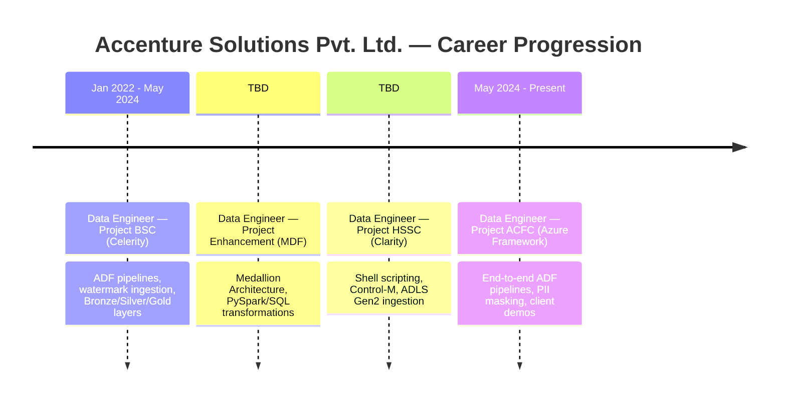
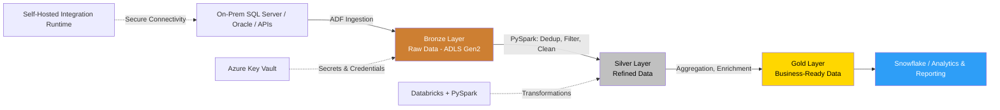

<h1 align="center">Hi 👋, I'm Rambharat Patel</h1>
<h3 align="center">Data Engineer | Azure • PySpark • Databricks | Big Data & Cloud Enthusiast</h3>

  

---

### 👤 About Me

- 🔭 Currently working at **Accenture Solutions Pvt. Ltd.** as a **Data Engineer**
- 💼 4.6+ years of experience in **API Integration, Data Quality, Data Streaming, and PII Data handling**
- ☁️ Skilled in migrating on-premise files to **Azure Storage (Raw → Refine → Snowflake Layer)**
- 🧠 Proficient in **PySpark, Databricks, Python, SQL, and Azure Data Factory**
- 🌱 Strong understanding of **distributed computing principles** and Medallion Architecture
- 💬 Ask me about **ETL pipelines, Azure Databricks, ADF, Delta Lake, Data Warehousing**
- 📫 Reach me at **patelrambharat@gmail.com**

---

### 🔗 Connect with me

---

### 🛠️ Tech Stack

**Languages:** Python • SQL • Scala (Spark) • JSON • YAML
**Big Data & Cloud:**   Azure Synapse Analytics • ADLS Gen2 • Delta Lake
**Platforms:** Microsoft Azure
**ETL Tools:** Azure Data Factory (ADF) • Azure Functions • SSIS
**Database & Storage:** SQL Server / Azure SQL • Oracle • HDFS • DBeaver
**DevOps & CI/CD:** GitHub/Bitbucket • Jenkins • Jira • Control-M
**Soft Skills:** Team Leadership • Project Management • Agile & Scrum

---

### 🏢 Career Timeline

> ⚠️ Two role dates are still marked **TBD** — same placeholders flagged in your resume. Fill these in before publishing so the timeline lines up correctly (currently listed in resume order, not confirmed chronological order).

<b>📌 Role details (click to expand)</b>

**Data Engineer | Project: ACFC – Azure Framework** *(May 2024 – Present)*
- Developed end-to-end data pipelines using **ADF** to orchestrate movement of structured/unstructured data from SQL Server, Oracle, APIs, and Azure Blob Storage
- Optimized **PySpark notebooks in Azure Databricks** for batch and streaming transformations
- Performed **schema drift management** using dynamic dataflows in ADF
- Used **Azure Key Vault** to manage credentials, SAS tokens, and connection strings
- Built parameterized ADF pipelines (Lookup, ForEach, If Condition) for dynamic ETL
- Conducted **client demos** and translated business requirements into scalable solutions
- Implemented **PII data masking and encryption** using PySpark transformations

**Data Engineer | Project: HSSC – Clarity**
- Worked on on-premise source data using **shell scripting and Control-M**
- Pre-processed raw data on **Databricks using PySpark**
- Implemented **ADLS Gen2** workflows for raw ingestion, refinement, and downstream processing
- Deployed code via **Jenkins and UCD** after unit testing

**Data Engineer | Project: BSC – Celerity** *(Jan 2022 – May 2024)*
- Designed **ADF pipelines** for ingestion from on-premises, SQL Server, APIs, and cloud sources into ADLS Gen2
- Implemented **incremental/watermark-based ingestion** to avoid reprocessing records
- Configured **Self-Hosted Integration Runtime** for secure on-prem-to-Azure connectivity
- Designed **Bronze, Silver, Gold** data layers in ADLS Gen2
- Participated in **Agile ceremonies** (sprint planning, stand-ups, retrospectives)

**Data Engineer | Project: Enhancement – MDF**
- Designed end-to-end Azure solution using **Medallion Architecture**
- Built transformation workflows using **Databricks, Apache Spark, PySpark, SQL**
- Performed **source-to-target validation** for data accuracy and completeness
- Designed and executed **test plans and test cases** for Big Data applications

---

### 🔄 Data Pipeline Architecture (Medallion Pattern)

---

### 🚀 Key Achievements

| Achievement | Detail |
|---|---|
| 🏅 Checksum-based deduplication framework | Built in PySpark + ADF, ensured 100% data accuracy |
| 🏆 Microsoft Certified: Azure Data Engineer Associate | DP-203 |
| 🥇 Top performer | Recognized in quarterly reviews for on-time delivery |

---

### 🎓 Education

**Bachelor of Technology in Electronics and Communication Engineering**
*Madan Mohan Malaviya University of Technology | July 2018 – July 2021*
CGPA: 8.31 / 10.0

---

### 📜 Certifications

| Certification | Issuer |
|---|---|
| ✅ Microsoft Certified: Azure Data Engineer Associate (DP-203) | Microsoft |
| ✅ Semiconductor Optoelectronics | NPTEL |

---

### 📊 GitHub Stats

  
  

  

  

